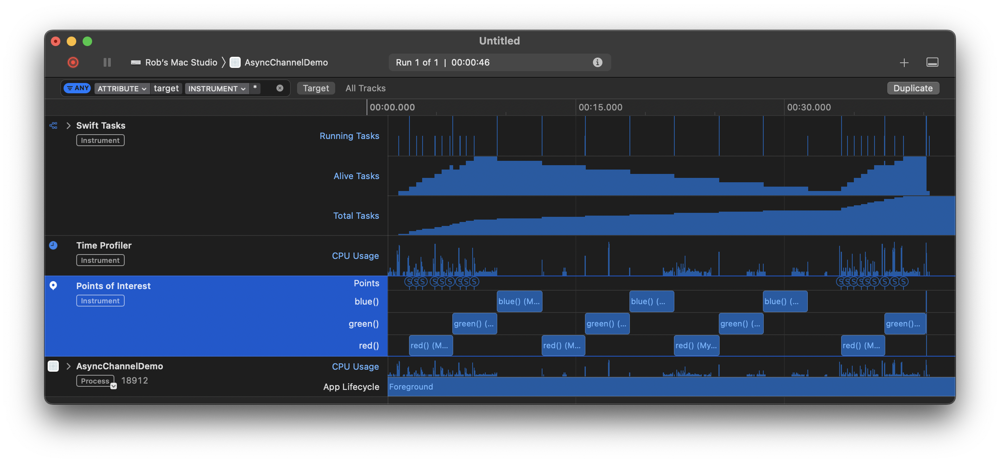

#  AsyncChannelDemo

This is a demonstration of `AsyncChannel` as contemplated in https://stackoverflow.com/a/75730483/1271826.

In the following screen snapshot of “Instruments”, I rapidly tapped “red”, “green”, and “blue” buttons in succession, repeating the process three times. I then repeated the exercise, but this second time, I dismissed the view in question before it was completed, thereby canceling the channel (and its associated tasks).

- - -

## Build configuration

Built in Xcode 15.2 and Swift 5.9.2.

- - -

## License

23 January 2024

Copyright © 2024 Robert M. Ryan. All Rights Reserved.

See [License](LICENSE.md).
